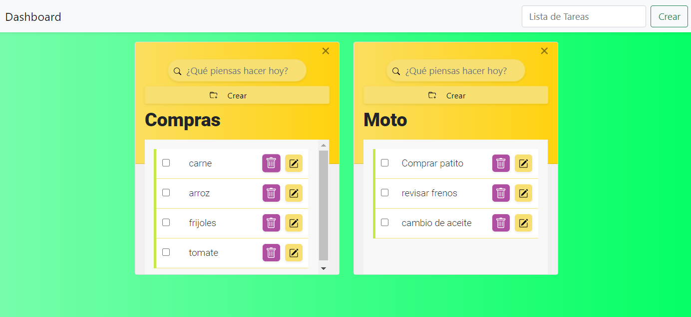

# CHALLENGE - TODO LIST #

## Summary ##

En este desafió realizará un TO-DO List en tiempo optimo, con las características necesarios para exponerse como un **Full-Stack Developer**.

Se utilizarán las siguientes tecnológicas:

* Spring Boot con Webflux
* Angular
* MySQL
* Docker

### Caso de Uso ###

Se tiene presente un formulario donde se registra unas tareas basadas en una lista por hacer. Esta lista se crea para poder tener una grupos de items donde se pueda gestionar un CRUD. Se tiene un diseño muy básico pero totalmente funcional.

### Requerimientos para desarrollo ###

- Maven > v3
- NodeJS > v6
- NPM > v3
- Java > v11

### Requerimientos para la solución ###

- Docker > v19
- Docker Compose > v1

## APP TODO LIST ##

